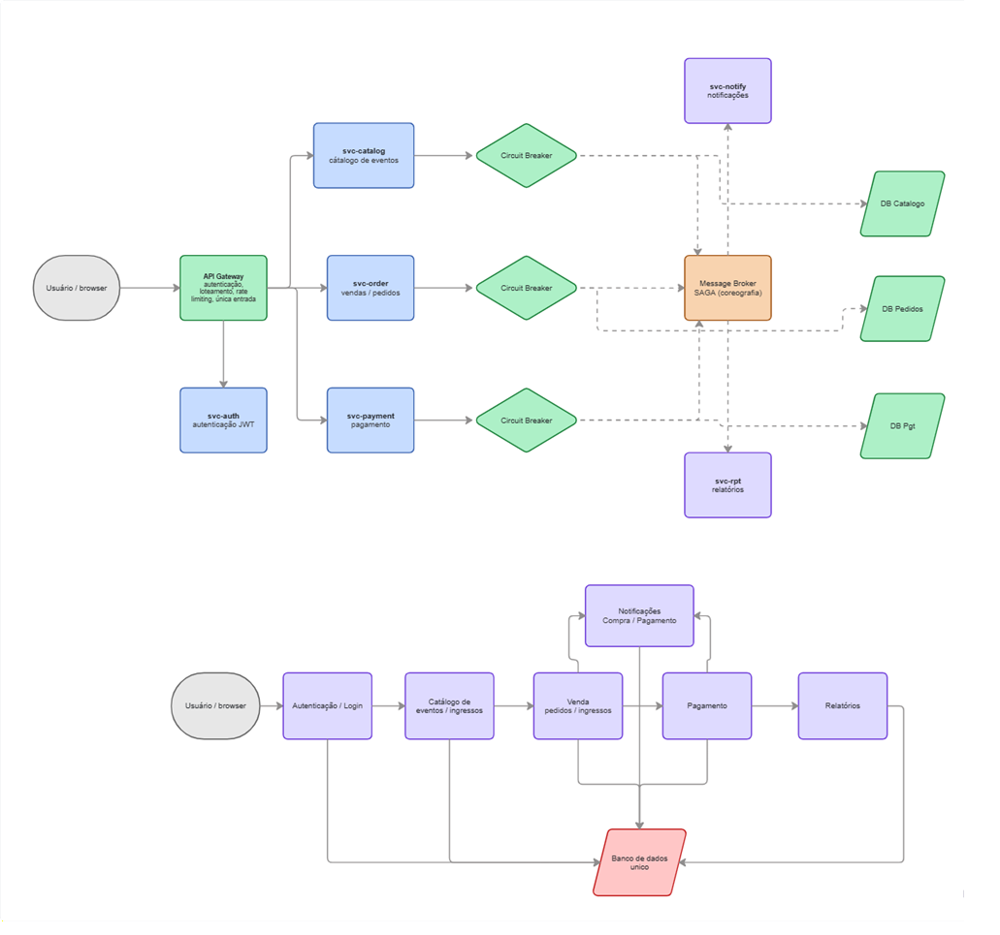

# Event Master

Sistema de venda de ingressos online desenvolvido como projeto prático para aplicar conceitos de arquitetura de software em um cenário realista. Venda de ingressos envolve picos de acesso imprevisíveis, integrações com gateways externos e fluxos transacionais que não toleram inconsistência — esse contexto guiou todas as decisões arquiteturais do projeto.

> **Problema (projeto-final):** o grupo escolheu implementar o **serviço de pagamentos** como escopo do projeto final.

---

## Serviço de Pagamentos

> Repositório: **[event-master-payment-service](https://github.com/Grupo-3-ADA/event-master-payment-service)**

---

## Diagramas de Arquitetura



---

## Visão Geral

O **EventMaster** é uma plataforma para criação, gerenciamento e venda de ingressos para eventos. A solução foi projetada com foco em escalabilidade, resiliência e desacoplamento entre domínios, adotando microsserviços com comunicação assíncrona via Message Broker e o padrão SAGA (coreografia) para garantir consistência distribuída.

---

## Design e Estrutura

A divisão em microsserviços reflete como cada área do negócio funciona, evolui e opera de forma independente. Centralizar tudo em um monolito aumentaria o acoplamento entre áreas que deveriam evoluir separadamente.

### Microsserviços

| Serviço | Responsabilidade |
|---|---|
| **API Gateway** | Única entrada, autenticação centralizada e rate limiting |
| **svc-auth** | Autenticação e autorização via JWT |
| **svc-catalog** | Catálogo de eventos, lotes e ingressos (alto volume de leitura) |
| **svc-order** | Gestão de vendas, reserva de ingressos e estado da compra |
| **svc-payment** | Processamento de pagamentos e integrações com gateways externos |
| **svc-notify** | Notificações de compra e pagamento |
| **svc-rpt** | Geração de relatórios financeiros |

### Por que separar cada domínio?

**Catálogo:** concentra grande volume de leitura, especialmente em lançamentos populares. Separar permite escalar apenas as consultas sem impactar os fluxos transacionais.

**Venda e Pedido:** concentra regras críticas de negócio. Inconsistências aqui causam reservas duplicadas e perda de ingressos. Isolá-lo evita efeitos colaterais vindos de outros contextos.

**Pagamento:** depende de serviços externos (gateways) sujeitos a timeouts e instabilidades fora do controle da aplicação. Isolar esse contexto permite aplicar estratégias específicas de tolerância a falhas sem comprometer os outros domínios.

---

## Padrões Arquiteturais

### API Gateway
Porta de entrada única para qualquer requisição. Centraliza autenticação e roteamento, impedindo que a estrutura interna fique exposta diretamente. Em picos de acesso (abertura de vendas de grandes eventos), esse controle centralizado organiza o tráfego e protege a aplicação.

### Circuit Breaker
Aplicado principalmente na comunicação entre pedido e pagamento. Sem esse mecanismo, falhas repetidas no serviço de pagamento travavam o serviço de pedidos por propagação. O circuito interrompe temporariamente as tentativas quando detecta instabilidade, dando tempo para o serviço se recuperar sem derrubar o restante da operação.

### SAGA (Coreografia)
Garante consistência entre a reserva de ingressos e o processamento do pagamento. Como cada serviço tem seu próprio banco de dados, transações distribuídas convencionais não se aplicam. O fluxo ocorre em etapas:

```
Criar pedido → Reservar ingresso → Processar pagamento
    └── Se falhar: eventos de compensação liberam o estoque
```

A coreografia foi escolhida porque cada serviço reage a eventos e dispara o próximo passo sem depender de um orquestrador central, reduzindo o acoplamento.

---

## Processamento e Performance

### Stream (Tempo Real)
Operações diretamente ligadas às ações do usuário e ao estado da compra. Eventos como aprovação, rejeição ou geração de boleto são publicados em tópicos Kafka para que os demais serviços reajam sem chamadas síncronas entre si. O reprocessamento de pagamentos com inconsistências também segue essa lógica, isolando o problema sem interromper o restante da aplicação.

### Batch
Operações onde o imediatismo não é necessário e onde se trabalha com volume de dados:
- **Expiração de boletos:** job agendado verifica vencimentos sem impactar os serviços transacionais.
- **Relatórios financeiros:** totais de venda, taxas, estornos e inadimplência são processados diariamente, com muito menos pressão sobre a infraestrutura.

---

## Segurança

- **OAuth 2.0 + JWT:** autenticação centralizada no serviço dedicado. A API Gateway valida o token antes de encaminhar qualquer requisição; o payment service recebe apenas chamadas já autenticadas.
- **Webhook de boleto:** chamadas vêm de gateways bancários externos, não de usuários autenticados. Validação por HMAC, tokens secretos compartilhados ou restrição por IP.
- **Idempotência:** antes de criar um novo pagamento, o sistema verifica se já existe um com o mesmo `pedidoId`, prevenindo duplicidade em cenários de retry ou falha de rede.
- **Outbox Pattern:** eventos de pagamento são persistidos junto da transação principal antes de serem publicados no Kafka, eliminando a janela de inconsistência entre banco e mensageria.
- **Validação em múltiplas camadas:** DTOs com `@Valid`, `@NotNull`, `@DecimalMin` e validações no próprio domínio.
- **Zero Trust (planejado):** cada comunicação entre serviços deve ter autenticação própria e validação explícita de permissões. A centralização no gateway e a divisão em microsserviços já apontam nessa direção.

> **Limitações conhecidas do estágio atual:** dados de cartão ainda são armazenados no banco (sem tokenização completa); endpoints sem autenticação real; Kafka e banco sem criptografia no ambiente de desenvolvimento.

---

## Fluxo Principal do Usuário

```
Usuário / browser
    └─> Autenticação / Login
        └─> Catálogo de eventos / ingressos
            └─> Venda de pedidos / ingressos
                └─> Pagamento
                    ├─> Relatórios
                    └─> Notificações (compra e pagamento)
```

---

## Conclusão

As decisões do EventMaster partiram de um problema concreto: sistemas de venda de ingressos falham exatamente quando mais importam, no momento de maior acesso. Cada escolha — SAGA, Circuit Breaker, separação Stream/Batch — existe porque havia um problema real por trás dela.

O projeto implementa atualmente o **payment service**, mas a estrutura reflete como o sistema completo funcionaria. As bases estão definidas de forma que novos serviços possam ser adicionados sem comprometer o que já existe.

---

## Repositórios

| Serviço | Repositório |
|---|---|
| Pagamentos | [event-master-payment-service](https://github.com/Grupo-3-ADA/event-master-payment-service) |

---

## Autores

- Alexandre Della Mônica Moreira
- Daniela A. Fontana
